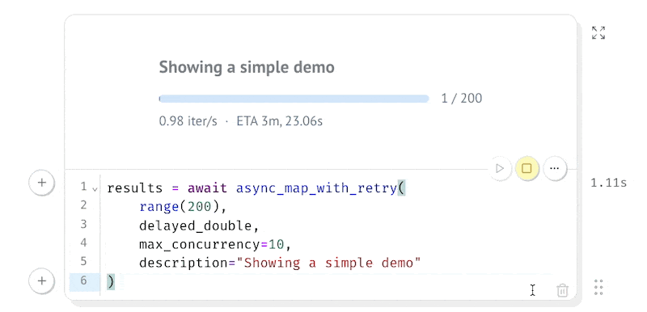

### mosync

> A utility for async batch jobs in marimo 

## Install

```
uv pip install mosync
```

You preview this library straight from Github pages [here](https://koaning.github.io/mosync/) without installing anything locally thanks to the WASM integration of marimo. 

## Why?

I made this because it felt like a missing cog in a lot of LLM experiments that I do inside of marimo notebooks. Some LLM vendors do not provide a batch endpoint, in which case you are better off just sending batches of requests async. It will also work for many other use-cases, but this is what I had in mind. Here's what the experience looks like inside of the notebook: 



Here's the code:   

```python
import asyncio
from mosync import async_map_with_retry


async def delayed_double(x):
    await asyncio.sleep(1)
    return x * 2

results = await async_map_with_retry(
    range(200), 
    delayed_double, 
    max_concurrency=10, 
    description="Showing a simple demo"
)
```

The results that you get back are `ProcessResult` objects. We have one for every input and these allow us to also log any errors that might have happened. Pay attention though! We do not guarantee the original order, so the items may have been shuffled around a bit. 

## Features

This library tries to think ahead, so you can expect:

- support for some light logging
- retry mechanics
- use of marimo widgets for a clean sign of life
